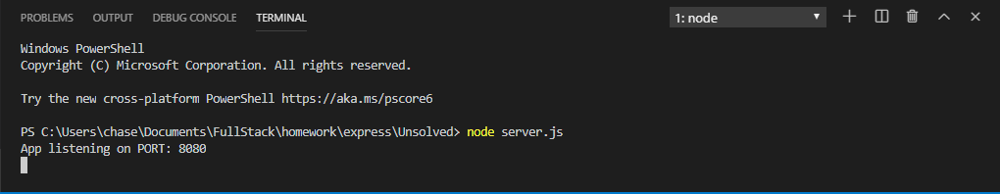
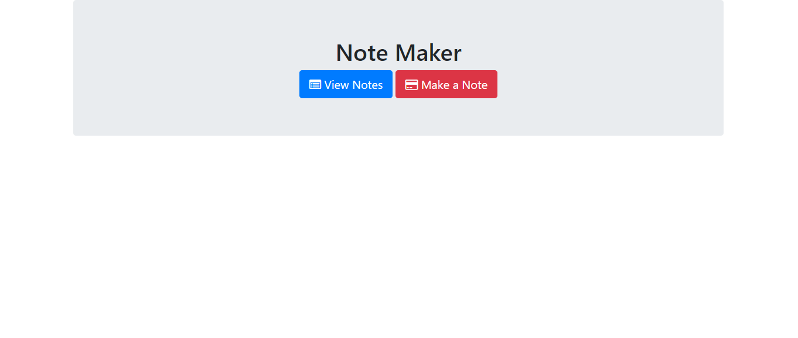
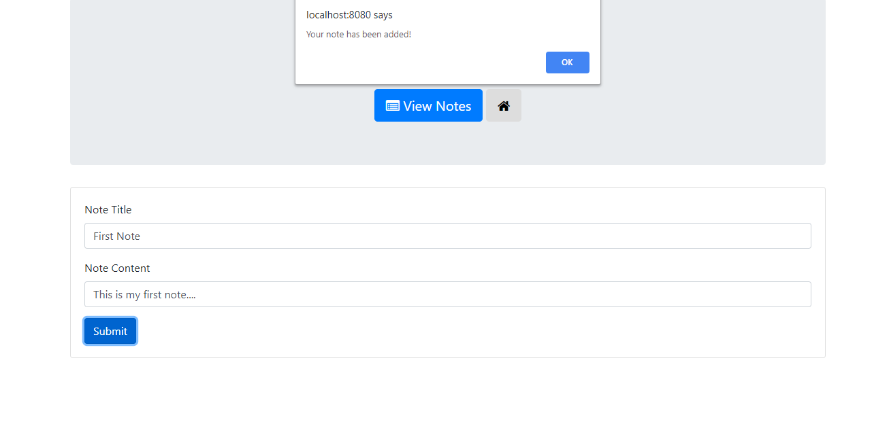
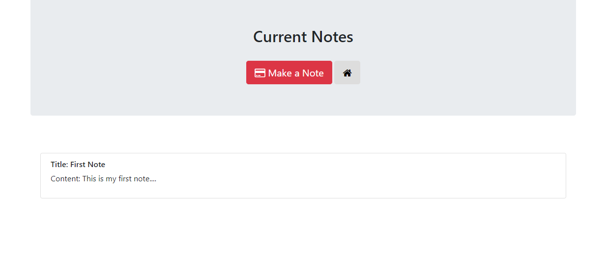

# express
This project is a Note taker that allows a user to write a note containing a title and the content. After submission it will be added to the note page where all notes can be viewed.

Step 1: Start server in Node

Step 2: Open in Browser and Click new note

Step 3: Fill out content of your note and submit

Step 4: View Notes in View Notes page

