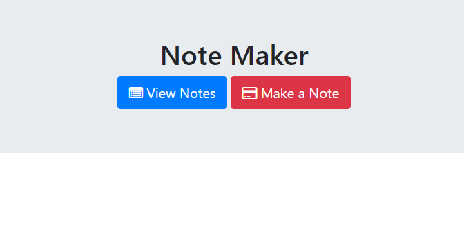

# Note Taker

The Note Taker application is a website that allows a user to create a note, and view them in the future. It features a Express back-end and a jQuery front-end. When each note is submitted it is written to a journal file. The journal file is read and displayed on the View Notes page. App is deployed to Heroku.

## Built With

* JavaScript
* HTML/CSS
* jQuery
* Express
* Heroku

## Pages

### Front Page

The homepage of the 3 page website.

### Create Note

On this page the user can create a note and submit it.

### View Notes

View all notes saved by the user.

https://note-taker-uci.herokuapp.com/notes